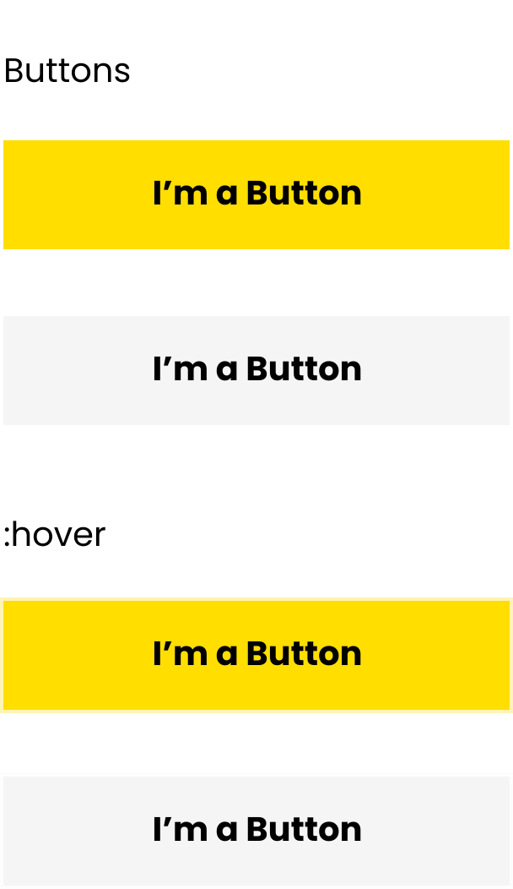

# Componentes

Este componente tiene dos posibles sabores, el primario con un fondo amarillo, texto bold.

Y el sabor secundario con fondo gris.

Ambos componentes hacen una sombra externa de 4px del mismo color de su fondo al hacer `hover` en ellos.